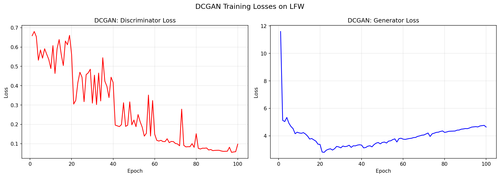
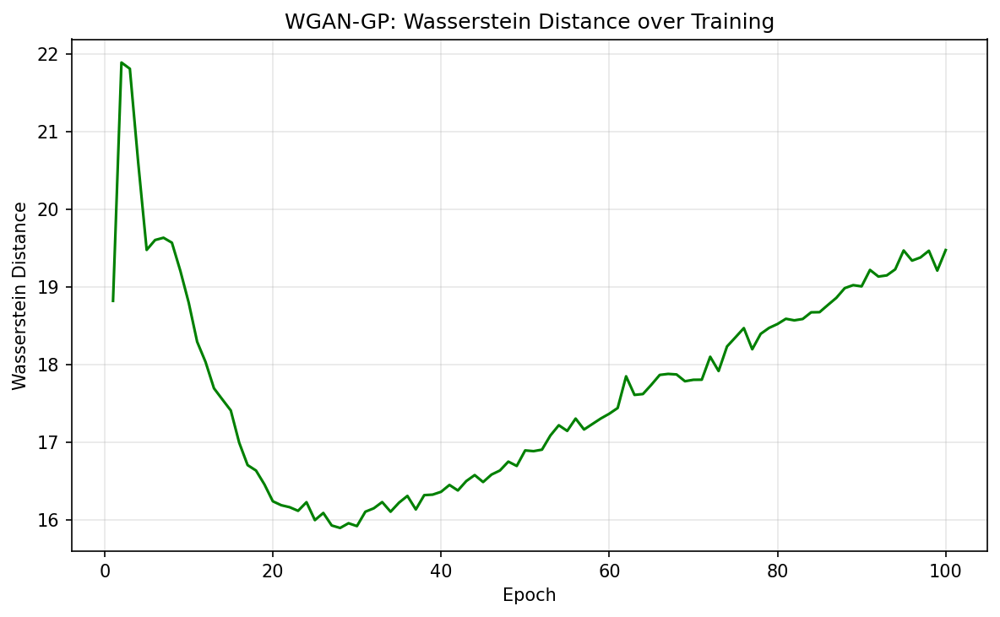
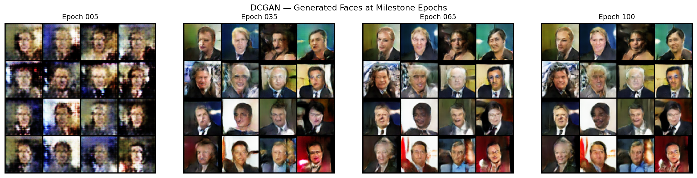
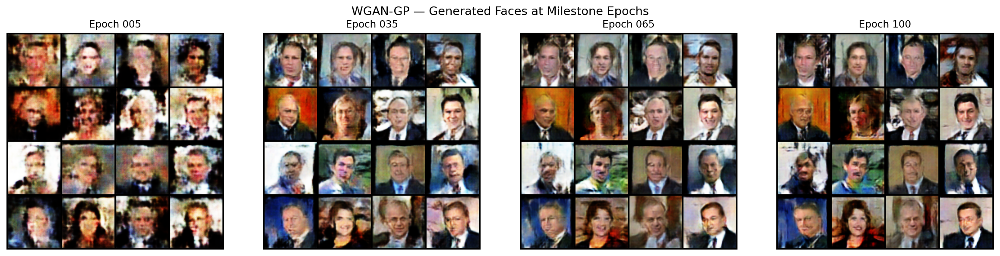
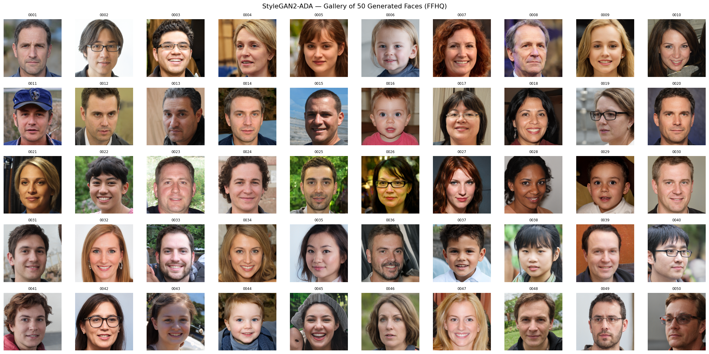
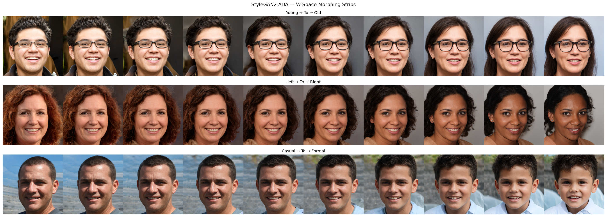

# DCGAN vs WGAN — VIZA 671 HW2

Implementation and comparison of DCGAN and WGAN-GP for face generation on the [LFW dataset](https://huggingface.co/datasets/logasja/lfw).

## What was done

- Implemented **DCGAN** (standard adversarial loss) and **WGAN-GP** (Wasserstein loss + gradient penalty)
- Trained both models for **100 epochs** on LFW face images
- Compared training stability via loss curves and visual output at epochs 5, 35, 65, and 100
- Generated a gallery of faces and latent space morphs using a pretrained **StyleGAN** (FFHQ)

## Results

| DCGAN Loss | WGAN Loss |
|---|---|
|  |  |

| DCGAN Milestones | WGAN Milestones |
|---|---|
|  |  |

**StyleGAN Gallery**


**Latent Space Morphs**


## Structure

```
scripts/          Training and generation scripts
results/          Output images and visualizations
HW2.ipynb         Main notebook
```
